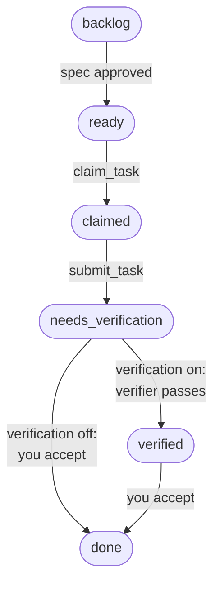

# Agent execution

mindpm can hand a task to a coding agent that has no conversation context, and keep parallel agents from colliding.

**Lifecycle.** Task statuses are handoffs, enforced by the server. The forward path:

Every other move:

| From | To | When |
| --- | --- | --- |
| `claimed` | `ready` | `release_task`, `report_failure`, or the lease expires |
| `claimed` | `blocked` | `report_failure` with `dependency` |
| `claimed` | `needs_human` | `escalate`, or `report_failure` with `spec_gap` or `design_conflict` |
| `needs_verification` | `ready` | The verifier fails it, or you reopen it with findings (verification off) |
| `needs_verification` | `needs_human` | Three verifier errors in a row |
| `verified` | `ready` | You reopen it with findings |
| `blocked` | `ready` | Every task in its `blocked_by` is done |
| `needs_human` | `ready`, `blocked`, `backlog`, `needs_verification` or `cancelled` | A human resolves it: requeue, revise the spec, verify again, or cancel |
| any but `done` | `cancelled` | A human cancels it |
| `done` | `ready` | A human reopens it |

**Attempts.** A failure, an expired lease, a failed verification or a reopen uses an attempt; `release_task` and `escalate` don't. Once the last one is used (`max_attempts`, 3 by default), the task goes to `needs_human` instead of `ready`. Tasks also wait in `backlog` while their spec is a draft.

Phases inside a run (implementing, testing, fixing) are heartbeat events, not statuses. Agents can't write status; only a human (`human:<name>`) can, through `update_task` or the Kanban board. An agent that a human explicitly asks to make such a change passes its own id with `on_behalf_of: "human:<name>"`: it gets the human's permissions, history records both, and it is refused on work the agent claimed or submitted itself. When a task reaches done, blocked tasks whose blockers are all done move to ready.

**Specs.** An architect (`agent:architect` or a human) writes a spec with acceptance criteria and a risk level, then links tasks to it. Tasks wait in backlog until the spec is approved. Medium and high risk need a human to approve. Every task is accepted by a human (after a verifier, when the project's verification is on): low-risk work in batches (the board, or `accept_tasks` from chat when you ask), medium and high risk one by one in the Kanban UI. Approval writes `specs/SPEC-<n>.md` into the repo for a human to commit. The database stays the source of truth.

**Claims.** `claim_task` is atomic and returns a claim token plus the task brief. The lease (30 minutes by default, 120 max) is extended by `heartbeat`; an expired lease ends the attempt, counts toward `max_attempts` (3 by default), and returns the task to the queue. Every write after the claim is authorized by the token, so an agent whose lease lapsed can't overwrite a newer attempt.

**Brief.** `get_task_brief` returns the whole contract for one run in under about 2,000 tokens: task, spec, criteria, conventions, verification commands (project defaults, overridden per task), relevant decisions (spec-linked plus the top 5 by full-text rank; superseded decisions never appear), dependencies, and what previous attempts learned.

## Accepting work

Work an agent submits waits in `needs_verification` for you. Accept it, or reopen it with findings for the next attempt: low-risk tasks in a batch (the board, or `accept_tasks` from chat when you ask), medium and high risk one by one in the Kanban UI. An agent can never accept its own work.

**Verification (optional, for unattended agents).** Turn it on per project in the **Verifiers** tab, and a registered verifier must rebuild and test each submitted commit in a clean checkout before you can accept it. It is off by default. See [Advanced: unattended agents and verification](advanced-verification.md).
