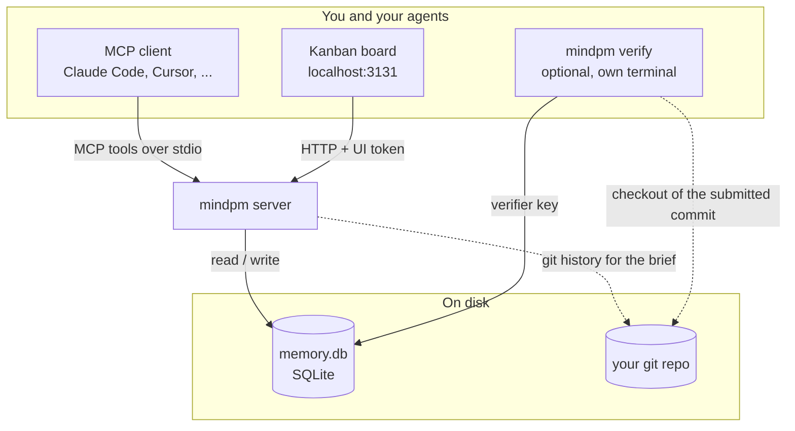

# How it works

Everything runs on your machine. The MCP client and the board talk to the mindpm server; the server and `mindpm verify` share one SQLite file.

A typical session:

1. You start a conversation and mention your project
2. The LLM calls `start_session` → gets full context
3. During the conversation, it creates tasks, logs decisions, adds notes
4. When you're done, it calls `end_session` → saves what's next
5. Next conversation: instant context, zero re-explanation

## What it tracks

- **Tasks** — handoff status, priority, blockers, sub-tasks
- **Specs** — objective, why, approach, constraints and acceptance criteria an agent can execute against
- **Attempts** — every agent run on a task: outcome, root cause, what to avoid next time
- **Verification runs** — what a verifier executed on a submitted commit (checks, exit codes, test reports) and what it concluded for each acceptance criterion, with evidence
- **Verifiers** — the registered processes allowed to verify work, identified by a secret key stored only as a hash
- **Decisions** — what was decided, why, what alternatives were rejected
- **Notes** — architecture, bugs, ideas, research
- **Context** — key-value pairs (tech stack, conventions, config)
- **Sessions** — what was done, what's next
